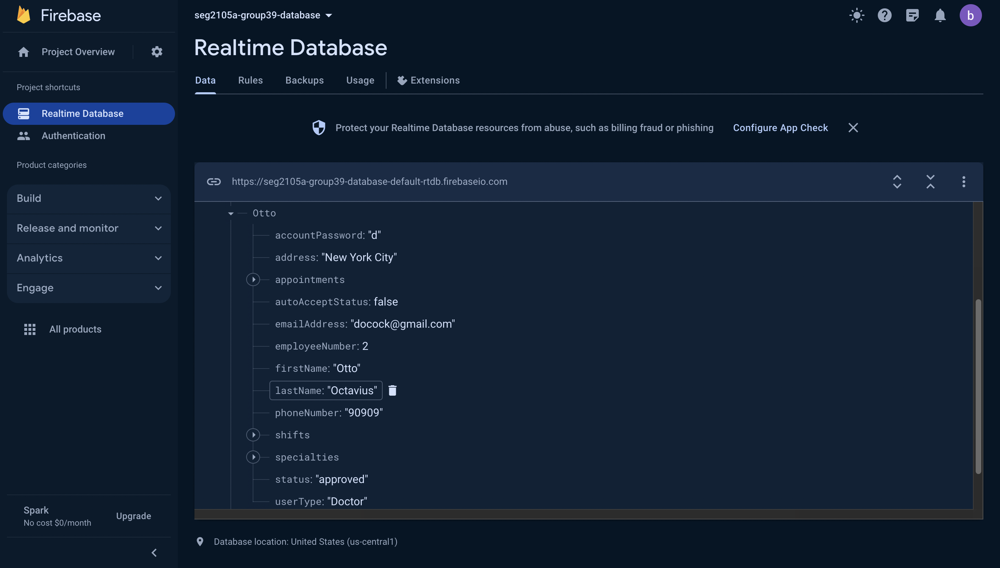

# SEG2105A Project - Group 39
## MediME

In this project, our team implemented a Healthcare Appointment Management System (HAMS) for a telehealth clinic. HAMS is a mobile application designed to streamline the process of healthcare appointment scheduling and management. 

The app currently supports three types of users: Patient, Doctor, and Administrator, and features such as logging in, signing up, logging off, and has its data securely stored and authenticated online using Firebase's Realtime Database.

## Contributors:

- Balpreet Singh
- Daniel Guo
- Dipak Chinnasamy Selvam
- Leon Mathews
- Steven Yang
- Tarek Rehouli

## Setting up the app

The app can be directly installed onto an Android phone using the `Project_Group_39_debug_apk_Deliverable_2.apk` file under the APK directory. Alternatively, the app can be run from the Android Studio Emulator by loading up the project under FinalProject/LoginApp. **Only use this directory as it is the final integration of all the app's features.**

Additionally, do take note of the following:

- The admin credentials are:
  + Username: admin
  + Password: admin
- Be sure to sync the project with `build.gradle.kts` Gradle file under the FinalProject/LoginApp directory **only**.
- When registering as a doctor, the specialties should be comma separated (e.g. "Heart,Brain")

## Screenshots

### Database

The app is able to store data on a Firebase database, as seen in the screenshot below:

### SVG credits:

App icon: https://www.flaticon.com/free-icon/daily-health-app_3845768